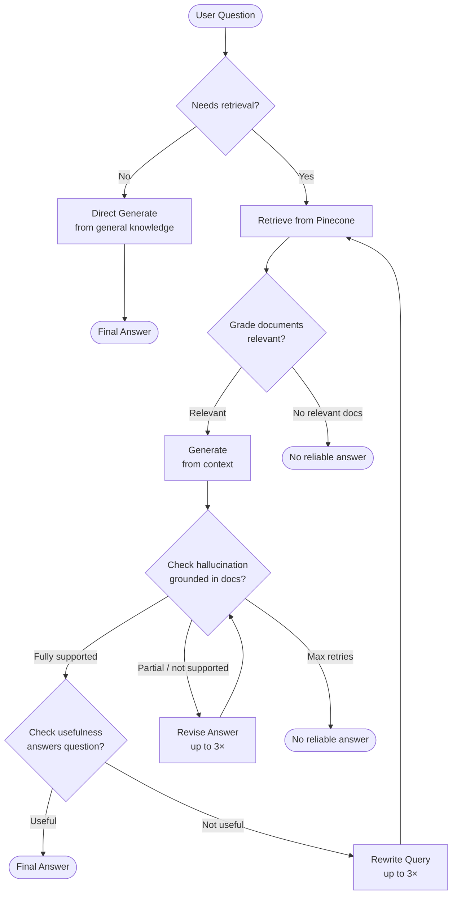

# DocSearch AI

## Overview

DocSearch AI is an advanced, visually interactive document querying system. It employs optical character recognition (OCR) natively on uploaded documents to construct multi-tenant semantic vector databases logic, seamlessly routing queries through an agentic **Self-RAG (Retrieval-Augmented Generation)** framework executed via LangGraph. 

It handles multiple concurrent sessions, PDF multi-document pinning, and evaluates its own answers dynamically against hallucination faults.

## Features

- **OCR-based Text Extraction**: Uses EasyOCR to process standard and scanned PDF pages across simultaneous requests.
- **Agentic Self-RAG QA Pipeline**: Engineered with LangGraph to determine *when* to retrieve, grade document context relevancy iteratively, filter hallucinated generations, and actively rewrite queries if an answer is inherently useless.
- **Native ChatGroq Integration**: Incorporates `langchain-groq` natively to invoke strict JSON-based schema structuring models over `llama-3.3-70b-versatile`, ensuring determinism in pipeline routers.
- **Session State & Multi-Document Pinning**: Allows continuous chat dialogues bounded correctly via database session histories bridging across multiple isolated PDF clusters.
- **Streamlit Frontend**: Interactively integrates upload ingestion, chat sessions, API key isolation, and deep metadata transparency metrics (sources, revision counts, support status).

## Architecture

The system has two pipelines: **Document Ingestion** and **Self-RAG Query**.

### Document Ingestion


### Self-RAG Query Pipeline (LangGraph)

When a user asks a question, it flows through an agentic graph that decides whether to retrieve, validates its own answers, and self-corrects:


### Key Design Decisions

| Component | Choice | Reason |
|-----------|--------|--------|
| LLM | Groq + llama-3.3-70b | Fast inference, structured output support |
| Embeddings | all-MiniLM-L6-v2 | Lightweight, 384-dim, good semantic quality |
| Vector DB | Pinecone (serverless) | Managed, metadata filtering per document |
| Graph engine | LangGraph | Native support for cycles, conditional edges |
| Chat storage | SQLite | Zero-config, local, sufficient for single-user |
| Config | config.yaml | All thresholds in one place, no hardcoded values |

## Setup & Installation

### System Dependencies
The image conversion heavily utilizes `poppler` bindings. You must ensure `poppler-utils` is installed on your host system:
- **macOS:** `brew install poppler`
- **Linux:** `sudo apt-get install poppler-utils`
- **Windows:** Download the latest poppler binaries, extract it, and map its `bin` folder onto your OS `PATH`.

### Local Deployment
```bash
git clone <repo_url>
cd DocSearch-AI

# Create virtual environment (recommended)
python -m venv venv
source venv/bin/activate  # On Windows use `venv\Scripts\activate`

# Install Python requirements
pip install -r requirements.txt
```

### Environment Variables
Create a root `.env` file referencing your backend credentials:
```env
API_KEY=your_generic_api_bearer_token 
PINECONE_API_KEY=your_pinecone_api_key
PINECONE_INDEX_NAME=docsearch-ai
GROQ_API_KEY=your_groq_api_key
```

---

## Usage Guide

1. **Spin up the Backend Server**
```bash
uvicorn main:web_app --reload
```
2. **Launch the User Interface** 
```bash
streamlit run app.py
```

### API Reference Endpoints

#### 1. Ingest Direct File Uploads
**POST** `/upload` 

**Headers:** `Authorization: Bearer <API_KEY>`

Accepts `multipart/form-data` with `files`. Multiple files can be passed simultaneously.
```json
{
  "Files uploaded": {
    "ab123456-c789-0123-d456-e78901234f56": "quarterly_earnings.pdf"
  }
}
```

#### 2. Process QA Queries through Self-RAG
**POST** `/query`

Pass the `pdf_ids` previously acquired iteratively and optionally string to persistent chat threads via `session_id`.
```bash
curl -X POST http://localhost:8000/query \
  -H "Authorization: Bearer YOUR_API_KEY" \
  -H "Content-Type: application/json" \
  -d '{
    "question": "What were the major growth drivers mentioned?",
    "pinned_pdf_ids": ["ab123456-c789-0123-d456-e78901234f56"],
    "session_id": "c138bca-..." 
  }'
```

**Self-RAG Augmented Response:**
```json
{
  "answer": "The major growth drivers mentioned were software licensing and regional logistics expansions.",
  "is_supported": "fully_supported",
  "is_useful": "useful",
  "revision_count": 0,
  "rewrite_count": 0,
  "sources": ["ab123456-c789-0123-d456-e78901234f56"],
  "retrieval_used": true,
  "session_id": "c138bca-..."
}
```

#### 3. Creating & Managing Isolated Chart Sessions
**POST** `/sessions`
Provides isolated context strings connecting historical history to exact document configurations securely bounded together via `sqlite3`.

```json
{
    "pinned_pdf_ids": ["ab123456-c789-0123-d456-e78901234f56"],
    "title": "Earnings Q3 Discussion"
}
```
